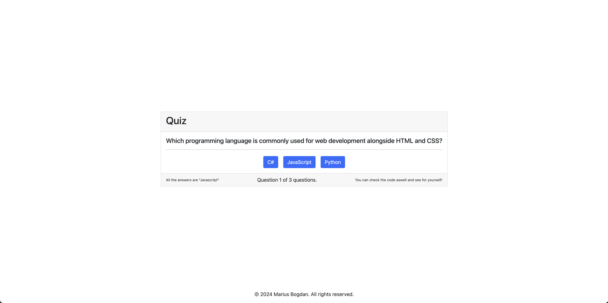

# Quiz App


[](#)


> A simple product management application that allows users to add, view, and remove products.

## Overview
**Quiz App** is an interactive web-based quiz that presents users with a series of multiple-choice questions. After answering all the questions, the app calculates and displays the total score. The project follows object-oriented programming (OOP) principles for structured and efficient functionality.

## Preview

<p align="center">
  
</p>

## Features
- **Interactive Quiz:** Users answer a series of multiple-choice questions.
- **Score Calculation:** Automatically calculates and displays the final score.
- **Object-Oriented Design:** Built using OOP principles for better structure and maintainability.
- **Minimal UI:** Clean and simple layout for an intuitive user experience.


## Live Demo
**Explore the live version here:** [View Live Demo](https://marius-bogdan.com/projects/quiz-app/)

## Local Setup
1. **Clone** the repository:
   ```bash
   git clone https://github.com/MIBogdan/quiz-app.git
   ```
2. **Open** the `index.html` file in your browser
   *- or use a local development server (like VS Code Live Server) for a smoother development experience.*


---

## Author
**Marius Bogdan**  
[Personal portfolio](https://marius-bogdan.com/)

Feel free to reach out for any questions or collaborations!

## License

This project is provided for testing and demonstration purposes only. All rights are reserved. No part of this project may be redistributed, reuploaded, or used in any manner (commercially or otherwise) without explicit written permission from the author.
